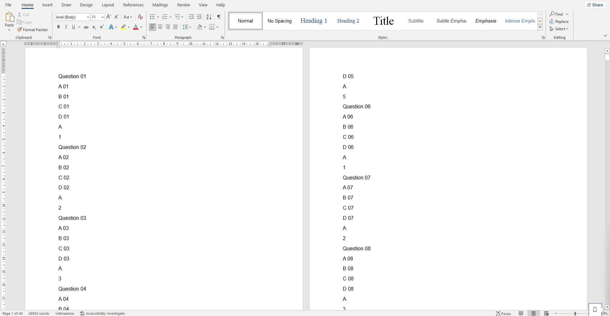
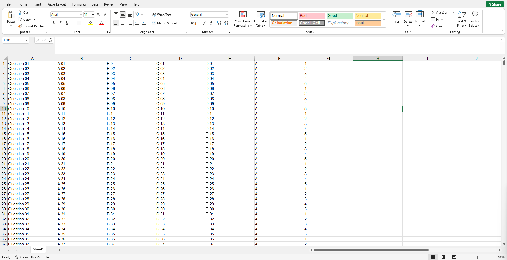
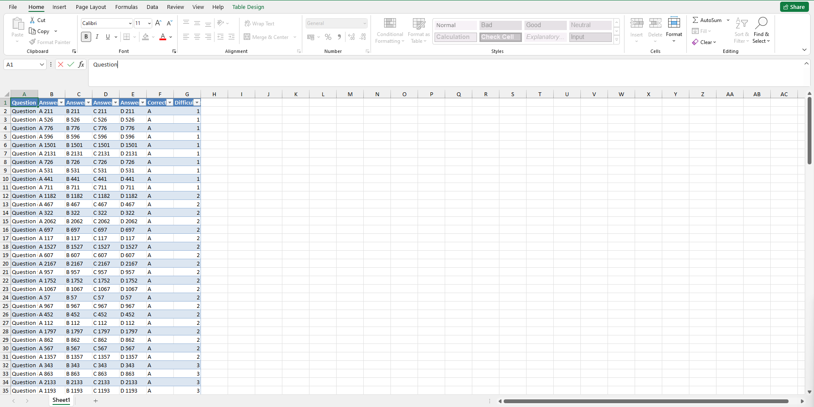

# GenerateQuestion
Module GenerateQuestion gồm các chức năng: <br>

* Đọc dữ liệu câu hỏi trắc nghiệm từ file **Word(.docx), Excel(.xlsx)**
* Xuất dữ liệu câu hỏi trắc nghiệm ra file **Excel(.xlsx)**
* Random câu hỏi trắc nghiệm từ ngân hàng đề đưa vào

## Dependency
* [ClosedXML](https://www.nuget.org/packages/ClosedXML)
* [Newtonsoft.Json](https://www.nuget.org/packages/Newtonsoft.Json/)

## Cách dùng
Sử dụng các public function để thực hiện các chức năng
* Đọc dữ liệu
```cs
    QuestionGenerator gq = new();
    // DataTable
    DataResponse<DataTable> dataResponseDT = gq.ReadData<DataTable>(@".\ReadFile_Test.xlsx");
    // List
    DataResponse<List<ModelQuestion>> dataResponse = gq.ReadData<List<ModelQuestion>>(@".\ReadFile_Test.xlsx");
```

* Đọc dữ liệu
```cs
    QuestionGenerator gq = new();
    // DataTable
    DataResponse<DataTable> dataResponseDT = gq.ExportData<DataTable>(dataResponseGenerate.Data, @"D:\Folder", "QuestionExport");
    // List
    DataResponse<List<ModelQuestion>> dataResponse = gq.ExportData<List<ModelQuestion>>(dataResponseGenerate.Data, @"D:\Folder", "QuestionExport");
```

* Random đề
```cs
    QuestionGenerator gq = new();

    // Cấu trúc đề thi
    List<DifficultStructure> ds = new List<DifficultStructure>() {
        new DifficultStructure() { DifficultLevel = 1, NumberOfQuestion = 10 },
        new DifficultStructure() { DifficultLevel = 2, NumberOfQuestion = 20 },
        new DifficultStructure() { DifficultLevel = 3, NumberOfQuestion = 30 },
        new DifficultStructure() { DifficultLevel = 4, NumberOfQuestion = 40 },
        new DifficultStructure() { DifficultLevel = 5, NumberOfQuestion = 50 }
    };

    // DataTable
    DataResponse<DataTable> dataResponseDT = gq.RandomQuestionsFromBank<DataTable>(dataSource, ds);
    // List
    DataResponse<List<ModelQuestion>> dataResponse = gq.ExportData<List<ModelQuestion>>(dataSource, ds);
```


## Kết quả
* Cấu trúc dữ liệu trả về
```cs
    // Cấu trúc Question Model
    public class ModelQuestion
    {
        public string Question { get; set; } = string.Empty;
        public string AnswerA { get; set; } = string.Empty;
        public string AnswerB { get; set; } = string.Empty;
        public string AnswerC { get; set; } = string.Empty;
        public string AnswerD { get; set; } = string.Empty;
        public string CorrectAnswer { get; set; } = string.Empty;
        public int DifficultLevel { get; set; } = 1;
    }

    // Cấu trúc đề
    public class DifficultStructure
    {
        public int DifficultLevel { get; set; }
        public int NumberOfQuestion { get; set; }
    }

    // Cấu trúc Response Data
    public class DataResponse<TDataType>
    {
        public TDataType? Data { get; set; } = default;
        public string Message { get; set; } = string.Empty;
        public StatusDataType Status { get; set; } = StatusDataType.Error;

        public DataResponse() { }

        public DataResponse(TDataType? data, string message, StatusDataType status)
        {
            Data = data;
            Message = message;
            Status = status;
        }

        public DataResponse(string message, StatusDataType status)
        {
            Message = message;
            Status = status;
        }
    }

    // Các trạng thái của DataResponse
    public enum StatusDataType
    {
        Success,
        Error
    }
```
* Hình ảnh dữ liệu
<p align="center" >
   
    Ảnh 1:  Dữ liệu Word file (Import)
</p>

<p align="center" >
   
    Ảnh 2:  Dữ liệu Excel file (Import)
</p>

<p align="center" >
   
    Ảnh 3:  Dữ liệu Excel file (Export)
</p>